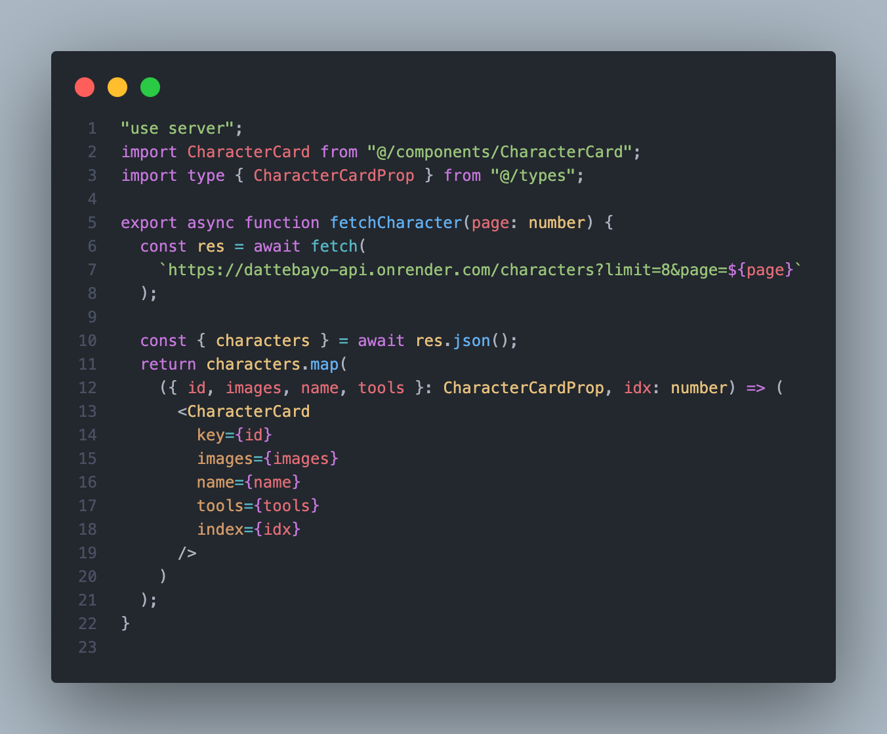
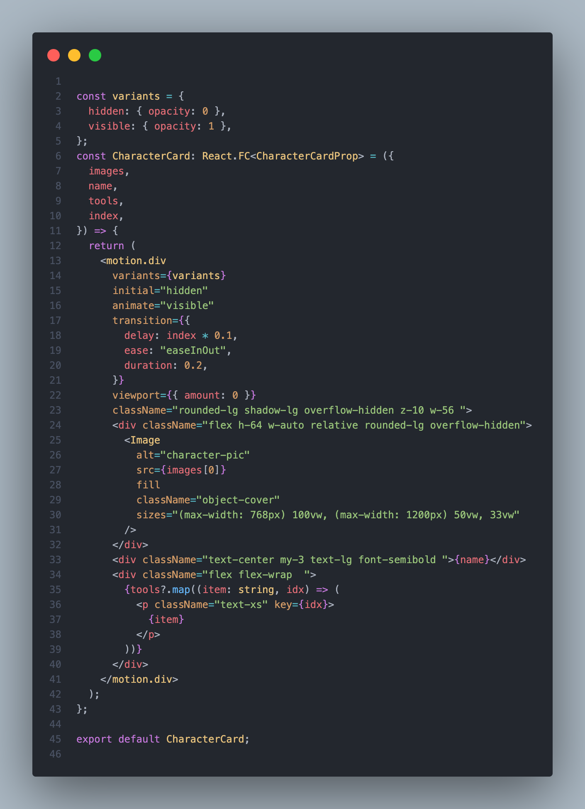
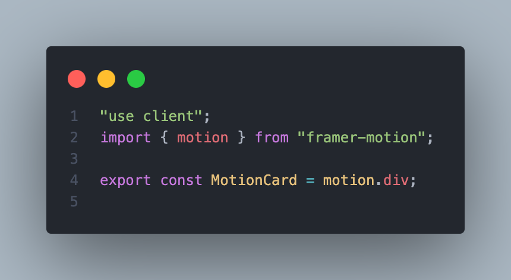
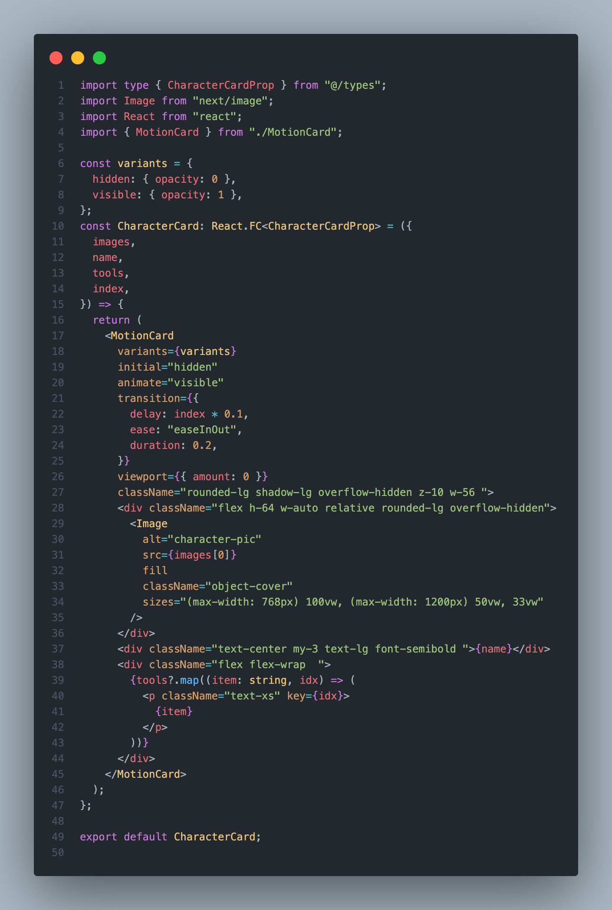

# Dattebayo

I've been diving deep into learning server-side actions with Next.js 14, mastering server rendering for optimized performance. Additionally, I've explored implementing infinite scroll functionality and integrated Framer Motion for seamless and captivating transitions within the project.

Thanks a lot to [Dattebayo](https://api-dattebayo.vercel.app/docs) team for creating an API related to one of my heroes

## Installation

Utilized the 3rd-party package [react-intersection-observer](https://www.npmjs.com/package/react-intersection-observer) for infinite scroll functionality and incorporated [Framer Motion](https://www.framer.com/motion/animation/) to ensure smooth transitions while loading each picture."

```bash
yarn
or
npm
```

then run

```bash
yarn dev
or
npm dev
```

## Ok, Lets talk about SERVER ACTION Next.js 14

### How Server Action Work ?

With Server Actions, you don't need to manually create API endpoints. Instead, you define asynchronous server functions that can be called directly from your components.
[...more detail](https://nextjs.org/docs/app/building-your-application/data-fetching/forms-and-mutations#how-server-actions-work)

Okay, now you can dive into this repository, download, or clone it, and then proceed with the execution.

#### Open the file: folder server/action.character.tsx



When you look at the code, yup function calls the API, and it's important to utilize 'use server' as we'll be executing this code on the server-side.

```bash
"use server"
```

Of course, you can query your database using the server action. Next, we'll be attempting to implement this using Action server

now tke look the part we animation transition using [Framer Motion](https://www.framer.com/motion/animation/).

as a i know the default of Next.js App router is server side, its event dont use "use server" on the top of file component.

ok take a look this code we usin framer motion server component mode.


and this is the result from browser


### WHY ?

The Framer Motion library operates entirely on the client-side browser.

you can move di motion to other file its mean in this issue we wanna run the animation from framer motion in the server side component.

create the new file:


then back to the component we gonna render on the server side.


## PART 2 (shoryly, we gonna to implement the grouping of route and protected them)

...Thanks.

## Contributing

Pull requests are welcome. For major changes, please open an issue first
to discuss what you would like to change.

Please make sure to update tests as appropriate.

## License

[MIT](https://choosealicense.com/licenses/mit/)
